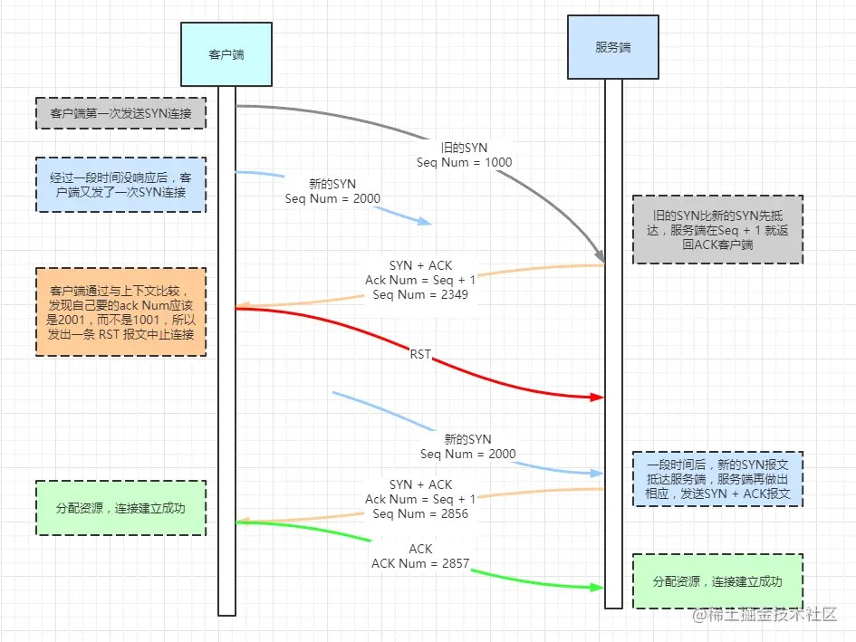
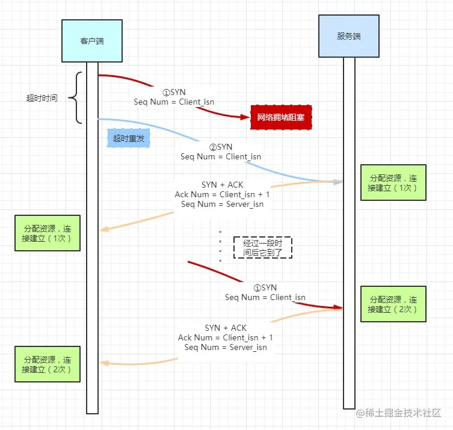
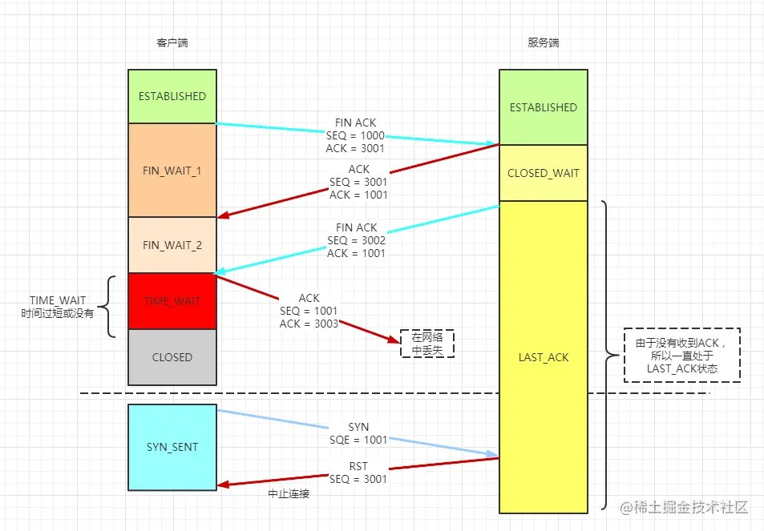
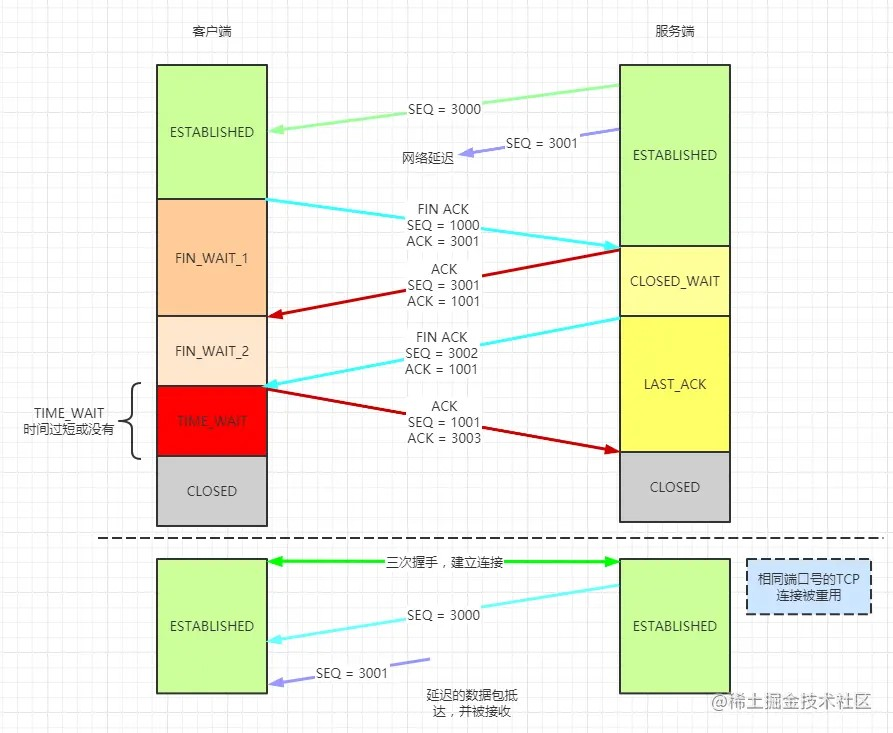

# 目录


# C/C++

## c和c++的区别：
  * c语言是面向过程语言;c++是面向对象语言。
  * 内存管理方式不一样
  * c++有函数重载、引用、封装、继承、多态等c语言没有的特性。

## struct与class区别：
  * struct可以实现继承、多态。
  * struct默认权限为public，class默认权限为private。
  * struct可以使用大括号初始化，class只有成员变量全部为public时才可以。
  * class可以用于定义模板。
  * 空的struct和class占1字节。

## const常量与define常量：
  * #define只是简单的替换，占可执行文件大小。
  * const常量有类型、地址，存放在只读数据段，只有一个拷贝。
  * #define没有类型检查，且调试不方便。

## const：
  * const修饰变量时表示不可修改，可防止意外修改。
  * const修饰成员函数时，表示不会修改对象的值，const成员函数不能调用非const成员函数。
  * const修饰指针时，默认修饰左边的内容，若左边为空则修饰右边的内容。
  * const_cast可去const或vaolatile属性。

## static：
  * static修饰变量时，变量在作用域内只有一份拷贝，存储在静态（全局）存储区。
  * 静态成员函数被所有对象共享，不能被非静态成员函数调用。非静态成员函数可以访问静态成员，静态成员必须在类外初始化。
  * static变量初始化：
    * C语言中静态变量只能由常量表达式编译时初始化。
    * 全局变量和全局静态变量在进入main前初始化，静态局部变量在第一次使用时初始化。
    * C++可以使用函数初始静态变量，但《Google C++ Style Guide》禁止。
    * C++11标准针规定了局部静态变量初始化需要保证线程安全。

## 静态多态和动态多态：
  * 多态是指一个接口，多个实现。
  * 静态多态：即编译时多态，编译时根据参数类型推导出需要调用哪个函数，由模板和重载实现。
  * 动态多态：即动行时多态，程序执行期间根据引用对象的类型调用不同函数，由虚函数实用。

## 自定义内存对齐方式
  ```C++
  #pragma pack(push, 1)
  #pragma pack(pop)
  ```

## 字节序

## 指针和引用
  * 指针即引用内容的地址，是一个实体
  * 引用是别名，对引用取地址即取引用内容的地址
  * 不存在空引用，引用定义时必须初始化，并且初始化后不能改变
  * 引用的sizeof是引用变量的大小，而指针的sizeof是指针变量的大小
  * 引用自增是引用变量自增，指针自增使指针指向下一个元素(数组名不能自增)
  * 智能指针
    * std::auto_ptr: 指针管理对象，允许拷贝和赋值，对象释放时自动释放指向的内存，不安全
    * std::shared_ptr: 带引用的智能指针，允许多个对象同时持有一个指针，当所有对象释放时自动释放指向的内存
    * std::weak_ptr: std::weak_ptr是弱共享，用于std::shared_ptr有循环引用问题。shared_ptr本身不增加shared_ptr的引用计数，当访问weak_ptr管理的内存时，需要先使用`expire()`判断shared_ptr是否有效，再通过`lock()`持有shared_ptr
    * std::unique_ptr: 独占的智能指针，不允许左值拷贝和左值赋值，但支持所有权转移(move)

## const \*和\* const区别
  * const默认修饰左边的对象，若左边没有对象，则修饰右边的对象
  ```C++
  const int *p;             // 修饰int
  int const *p;             // 修饰int
  int * const p = pp;       // 修饰int *
  const int * const p = pp; // 修饰int和int *
  ```

## 左值和右值
  * 左值是可寻址的变量(字符串常量、前置自增/自减的表达式是左值)
  * 右值一般是不可寻址的常量或在表达式求值过程中创建的无名临时对象
    * 纯右值(C++11之前的右值): 字面值、非引用的返回值、后置自增/自减的表达式、运算结果是字面值或临时对象的表达式、lambda表达式
    * 将亡值(C++11新增): 可使用右值引用延长生命周期(续命)
  * 左值引用:

    ```C++
    int a = 1;
    int &ra = a;
    const int &a1 = 1; // 常引用
    ```
  * 右值引用:

    ```C++
    int a = 1;
    int &&rr1 = 1;
    int &&rra = std::move(a);
    // 右值引用本身是左值
    ```
  * 引用折叠与完美转发:

    ```C++
    // T& &、T& &&、T&& &都折叠为T&
    // T&& &&折叠为T&&
    template <typename T>
    void
    f(T* p) {
      std::cout << "p" << " ";
    }

    template <typename T>
    void
    f(T& r) {
      std::cout << "r" << " ";
    }

    template <typename T>
    void
    f(T&& rr) {
      std::cout << "rr" << " ";
    }

    template <typename T>
    void
    ff(T&& rr) {
      // rr为左值
      f(rr);                  // T & &&  => void f(int T &)
      f(std::forward<T>(rr)); // 完美转发
      std::cout << std::endl;
    }

    int
    main(void) {
      int a = 1;
      int &ra = a;
      int *pa = &a;
      const int& r1 = 1;

      ff(std::move(a)); // T && &&       => void f(int &&)
      ff(1);            // T &&          => void f(int &&)
      ff(ra);           // T & &&        => void f(int &)
      ff(pa);           // T * &&        => void f(int *)，如果void f(T *p)未定义则实例化为void f(int *&)
      ff(r1);           // const T & &&  => void f(const int &)

      return 0;
    }

    //输出结果:
    //r rr
    //r rr
    //r r
    //p p
    //r r
    ```
  * std::move: C++11开始从语法层面支持了move语义，使用它可以使临时对象的拷贝具有move窃取功能
  * std::forward: 将一组参数原封不动的传递给另一个函数，参数在传递过程中保持其值属性;完美转发可以使一个函数同时提供左值引用和右值引用的版本，在提高效率的同时简化代码

    ```C++
    template <typename T>
    void
    f(T&& rr) {
      if (std::is_reference<decltype(rr)>::value) {
        if (std::is_lvalue_reference<decltype(rr)>::value)
          std::cout << "lf" << std::endl;
        else if (std::is_rvalue_reference<decltype(rr)>::value)
          std::cout << "rf" << std::endl;
      } else {
        std::cout << "other" << std::endl;
      }
    }

    template <typename T>
    void
    ff(T&& rr) {
      f(std::forward<T>(rr));
    }

    int
    main(void) {
      int a = 1;
      int &ra = a;
      int *pa = &a;
      const int& r1 = 1;

      ff(std::move(a));
      ff(1);
      ff(ra);
      ff(pa);
      ff(r1);

      return 0;
    }

    //输出结果:
    //rf
    //rf
    //lf
    //lf
    //lf
    ```

## explicit关键字防止隐式构造，如以下代码：
  ```C++
  class Point {
  public:
      int x, y;
      explicit Point (int x = 0, int y = 0)
              : x(x), y(y) {
      }
  };
  void displayPoint (const Point& p) {
  }
  int main() {
      displayPoint(1); // error: 无法从“int”转换为“const Point
      Point p = 1;     // error: 无法从“int”转换为“const Point
  }
  
  ```

## 类默认定义默认构造函数、默认赋值函数，由于是浅拷贝可能会导致内存泄漏和程序崩溃，需要显示定义或删除
  ```C++
  class noncopyableclass {
  public:
    noncopyableclass (const noncopyableclass&) = delete;
    noncopyableclass& operator = (const noncopyableclass&) = delete;
  };
  ```

  或继承noncopyable

  ```C++
  class noncopyable {
    noncopyable () = default;
    ~noncopyable () = default;
  private:
    noncopyable (const noncopyable&);
    noncopyable& operator = (const noncopyable&);
  };
  ```

## 异常

### 构造函数和析构函数
  * 构造函数可以抛出异常，抛出之前需要先释放已分配的资源
  * 析构函数可以抛出异常，但最好不要在析构函数中抛出异常，会导致后面逻辑的中断，引发内存泄漏的问题

### RAII
  * RAII机制用于管理资源的申请和释放，用于解决因析构函数中忘记释放资源导致的内存泄漏的问题，LockGuard即RAII的典型用法
  * RAII机制:
    1. 在构造函数中初始化资源
    2. 在析构函数中释放资源
  * 注意:
    * **C++的移动语义不像Rust会使原对象不可用，移动(移动构造函数和移动赋值函数)时原对象需要标记资源已释放，防止多次释放**
    * **RAII依赖异常机制，要小心处理异常、释放顺序、多次释放等情况**

### 二段式构造
  * 步骤
    1. 构造(create)，创建对象，并初始化一些与资源无关的成员
    2. 初始化(init)，初始化资源，有可能失败
    3. 清理(clear)，释放资源

## 面向对象

### 类
  * 构造函数
    * 构造顺序: 构造父类、虚表指针赋值、初始化列表初始化、构造函数代码块
    * 初始化列表:
      * 使用初始化列表效率更高
        * 使用初始化列表: 执行父类带参数的构造函数
        * 不使用初始化列表: 先执行父类的默认构造函数，再对父类赋值/手动修改父类成员
      * 以下成员必须使用初始化列表初始化: const成员、引用、父类没有默认构造函数
      * 初始化列表并不能指定初始化的顺序，正确的顺序是，首先初始化基类，其次根据派生类成员声明次序依次初始化，这样避免了成员之前依赖的问题
    * 构造函数不能是虚函数的原因:
      * 对象不完整
      * 父类的构造函数是明确的
  * 析构函数
    * 为保证父类析构函数的正确执行，定义了虚函数的类都应当定义虚析构函数
    * 构函数不用virtual 的几种情况:
      * 仅作为private基类(非公有基类)使用的class不需要使用虚拟析构函数
      * 该类所有子类的析构函数都是trivial的
      * 保证这个类不被public继承(private/protected继承，在非friend函数/类中就无法用基类指针指向派生类)
      * 如果不需要用基类的指针指向派生类的对象
      * 不作为接口使用的基类

### 虚函数
  * 虚表在编译时已确定，构造时只是将父类虚表指针复制到子类对象
  * 每一个基类都会有自己的虚函数表，派生类的虚函数表的数量根据继承的基类的数量来定
  * 派生类的虚函数表的顺序，和继承时的顺序相同
  * 派生类自己的虚函数放在第一个虚函数表的后面，顺序也是和定义时顺序相同
  * 对于派生类如果要覆盖父类中的虚函数，那么会在虚函数表中代替其位置
  * 虚函数的缺点:
    * 多一次寻址(虚表指针+偏移，实际偏移在编译已确定，没有查表操作)
    * 无法内联
    * 执行时跳转到不确定的地址，编译器无法预测调用目标，不利于优化流水线
    * Cache Miss

### [分配器](https://zhuanlan.zhihu.com/p/185611161)

## 技巧/惯用法

### 可变长结构

    ```C
    struct {
      int iType;
      int iNum;
      int data[1];
    } DEMOMSG, *LPDEMOMSG;

    void
    pack_demo_msg (char *lpMsg, int data[], int iNum) {
      LPDEMOMSG lpDemoMsg = (LPDEMOMSG)lpMsg;
      lpDemoMsg->iNum = iNum;
      for (int i = 0; i < iNum; ++i) {
        lpDemoMsg.data[i] = data[i];
      }
    }
    ```
### Pimpl
  ```
  // in header file
  class widget {
  public:
      widget();
      ~widget();
  private:
      class impl;
      unique_ptr<impl> pimpl;
  };

  // in implementation file
  class widget::impl {
      //
  };

  widget::widget() : pimpl{make_unique<impl>() } { }
  widget::~widget() { }
  ```
  * 实现
    1. 实现Impl类，一般声明为私有内部类，建议配合RAII机制
    2. 使用的指针/智能指针访问Impl对象
    3. 实现/delete拷贝、赋值、移动构造函数和拷贝、移动赋值函数
  * 优点:
    * 编译防火墙: 防止修改头文件导致重新编译
    * 隐藏实现细节: 接口与实现分离

## 内存管理
  * new/delete与malloc/free:
    * new/delete是操作符;malloc/free是函数
    * new从自由存储区分配(默认为堆);malloc从堆分配
    * new成功时返回对象指针，失败时抛出std::bad_alloc异常，使用new(std::nothrow)时返回NULL;malloc成功时返回内存起始指针，需要强制转换为具体类型的指针，失败时返回NULL
    * new根据对象的大小分配空间;malloc需要自行计算
    * new[]/delete[]对数组进行分配和释放，并且会对每个对象进行构造/析构
    * realloc可重新分配内存;而new没有相应功能，需要重载operator new()自行实现
    * C++可通过set_new_handler设置new的错误处理函数，在new抛出异常之前调用;malloc需要判断返回值并自行处理
    * new分配内存后会调用构造函数，delete释放内存前会调析构函数
  * 自由存储区和堆:
    * 自由存储区不等于堆，堆可以是自由存储区的子集
    * 自由存储区可以是任何内存空间，比如全局/静态的的对象池
  * malloc和calloc
    * calloc用于分配n块大小为size的连续空间
    * calloc对分配的整块内存置0，malloc不会，因此malloc效率更高
  * delete this注意: [面试.md](../%C3%E6%CA%D4/%C3%E6%CA%D4.md)
    1. 确保对象是new出来的
    2. 确保delete后不会用该对象调用其它(非静态)成员函数
    3. 确保delete后不能访问对象的任何部分
    4. 确保delete后this指针不会被访问

# 操作系统

## 地址
  * 逻辑地址: 在有地址变换功能的计算机中，访内指令给出的地址(操作数)叫逻辑地址，由段地址和偏移地址组成
  * 物理地址: 出现在CPU外部地址总线上的寻址物理内存的地址信号
  * 线性地址: 段地址和逻辑地址组成线性地址，如果启用了分页机制，那么线性地址可以再经变换以产生一个物理地址，否则线性地址直接就是物理地址

## CPU寻址方式
  * 实模式: 程序访问的地址都是真实的物理地址，如8086中“段基址: 段内偏移地址”产生的逻辑地址就是物理地址;缺点: 用户程序和操作系统拥有同等权利，程序可以随意修改任意物理地址，甚至包括操作系统所在的内存，给操作系统带来极大的安全问题
  * 保护模式: CPU访问的所有地址都是逻辑地址(段寄存器都为0的话，逻辑地址就是虚拟地址)，CPU会通过“分段”或者“分页”方式来查寻到对应的物理地址;优点: 不仅为存储器共享和保护提供了硬件支持，而且为实现虚拟存储器提供了硬件支持，支持多任务，能够快速地进行任务切换和保护任务环境

## [分页](https://www.zhihu.com/question/50796850)

## <a id="vms">虚拟地址空间</a>
  
  以32位机器举例，进程的虚拟地址空间最大为4GB，其中1GB为内核空间(所有进程共享)，进程可访问的实际用户空间只有3GB
  Linux进程的内存段组成如下:
  * 保留区: 0x00000000-0x08048000
  * 代码段(text): 线程间共享，只读
  * 数据段(data): 存放已初始化的且初始值不为0的全局变量和静态局部变量，可读写
  * BSS段: 存放未初始化的静态变量、初始值为0的初始化的全局变量和静态变量、未定义且初值不为0的符号(该初值即common block的大小)，BSS段不占用可执行文件空间，推迟到加载阶段初始化为0(符号表中会有相关变量的描述)
  * 堆(heap): 堆用于存放进程运行时动态分配的内存段，可动态扩张或缩减
  * 内存映射段(mmap): mmap将文件映射到该段
  * 栈(stack): 由编译器自动分配释放，用于存放函数内的非静态局部变量、栈帧，可动态增长至RLIMIT_STACK
  * 环境变量和命令行参数
  * 其他
    * 只读数据段(rodata): 进程间共享，编译器自动去重，常量不一定在rodata，有可能在text
    * common段: 存放未初始化的全局变量(有的编译器会直接放在BSS段)
      > 强符号和弱符号
      > * 强符号指函数和初始化的全局变量(包括初始值为0的)，弱符号指未初始化的全局变量
      > * 同名的强符号只能有一个，否则链接器报"重复定义"错误
      > * 如果一个符号在某个目标文件中是强符号，在其他文件中是弱符号，那么选择强符号
      > * 如果一个符号在所有的目标文件中都是弱符号，那么选择其中占用空间最大的一个
      > * 应用: 程序在未正常链接某个库时也可以正常运行、库中定义的弱符号可以被用户定义的强符号所覆盖(例如版本用户自定义)
      >
      > 举例:
      > ```C
      > int a;                           # 弱符号
      > int b = 0;                       # 强符号
      > extern int c;                    # 外部符号，只是一个符号引用，即不是强符号也不是弱符号
      > int __attribute__((weak)) d = 2; # 弱符号
      >
      > #if defined(_WIN32)
      >   #pragma weak e
      >   int e = 2;                     # 弱符号
      > #endif
      >
      > int
      > main () {
      >   return 0;
      > }
      > ```

  
  

  目标文件各个段在文件中的布局:
  

  > [更多关于虚拟地址空间的内容](https://fanlv.wiki/2021/07/25/linux-mem/)

## mmap和shm
  * mmap(内存映射):
    * 将一个文件或者其它对象映射到进程的虚拟地址空间，使用户对这段内存区域的修改可以直接反映到内核空间，相反，内核空间对这段区域的修改也直接反映用户空间
    * 读写文件时不再需要使用read、write等系统调用对文件进行读写，减少一次拷贝
    * 当访问该区域的内存页时，若该地址的数据不在内存，则产生缺页中断，OS会从磁盘中拷贝对应页到物理内存
    * 对该区域的内存页写入后，会自动延迟回写脏页面到对应磁盘地址，也可使用msync()即时写入
    * mmap 不仅可以映射到磁盘上的普通文件，还可以映射到匿名文件，但匿名映射只能在父子进程中使用
  * shm(共享内存):
    * 将新开辟的物理内存映射到不同进程的虚拟地址空间
  * malloc分配大内存实际调用的是mmap
  * 区别:
    * mmap和shm都可以达到进程间通信和进共享的目的，但shm性能更高
    * mmap实际存储反应到硬盘，shm实际存储反应到内存
    * 对于普通文件的mmap映射，当机器重启，mmap文件还保存了同步映像

## 栈、堆
  * 栈:
    * [进程栈](#vms)
    * 线程栈
      * Linux内核没有线程的概念，Linux把线程当作进程来实现
      * Linux线程和进程的共享地址空间，但栈不共享，并且不能动态增长
      * Linux线程对应单个task，每个线程拥有一个task_struct，进程实际上是一个task组，每个进程拥有一个mm_struct，进程中的线程共享mm_struct结构
    * 内核栈
      * 进程通过到系统调用陷入内核时，使用的是单独的内核空间的栈，每个进程都会拥有属于自己的内核栈
    * 中断栈
      * 中断栈同样处于内核空间，中断栈是可以和内核栈共享，具体取决于内核的实现和处理架构
    > Linux的栈大小默认为8M(ulimit -s)，可使用 `ulimit -s` 修改，Windows的栈大小默认为1M(VC6)，可使用 `/stack` 参数修改
  * 堆:
    *
  * 栈和堆:
    * 生长方向: 栈的地址增长方向取决于平台和编译器实现(比如x86的栈是向下增长的(BSP>ESP)，原因是栈向下增长，堆向上增长，可以提高内存利用率)
    * 分配方式: 栈由编译器自动分配和释放;堆由程序员控制，容易产生内存泄露
    * 空间大小: 栈顶地址和栈的最大容量由系统预先规定，栈的大小超容量限制会栈溢出;堆的大小则受限于计算机系统中有效的地址空间
    * 效率: 压栈出栈由专门的指令执行，因此效率较高;堆由函数库提供，机制复杂，效率较低
    * 碎片问题: 栈是先进后出的队列，不存在碎片问题;堆的频繁申请释放操作会造成内存空间不连续，从而造成大量碎片，使程序效率降低

## 存储区域
  * 静态存储区: BSS段、数据段、代码段
  * 动态存储区: 堆、栈

## 动态库、静态库

### 动态库
  * 动态链接库映射区:

### 静态库

### **注意**
  1. **动态库中的全局变量、静态变量在进程间不会相互覆盖，写时拷贝(进程修改动态库中的全局变量、静态变量时，操作系统会重新分配内存并映射到进程地址空间，变量的逻辑地址不变)**
  2. **可执行文件和动态库同时引用同一个静态库，静态库中的全局变量和静态变量会分别初始化一次[详情](https://cloud.tencent.com/developer/article/1173666)**


# 编译原理

## PIC和PIE
  * PIC(位置无关代码)
  * PIE(位置无关可执行程序)
  * 两者是等价的，-fPIC用于生成动态库，-fPIE用与生成可执行文件

## _cdecl和__stdcall、_fastcall
  * _cdecl(_cdecl)是C/C++和MFC程序默认使用的调用约定;函数参数按照从右到左的顺序入栈，并且由调用函数者把参数弹出栈以清理堆栈(可变参数只能用__cdecl;由于每个调用__cdecl函数的代码都要包含清理堆栈的代码，产生的可执行文件大小会比较大)
  * __stdcall调用约定用于调用Win32 API函数;函数参数按照从右到左的顺序入栈，被调用的函数在返回前清理传送参数的栈，函数参数个数固定
  * _fastcall(__fastcall)约定用于对性能要求非常高的场合;_fastcall约定将函数的从左边开始的两个大小不大于4个字节(DWORD)的参数分别放在ECX和EDX寄存器，其余的参数仍旧自右向左压栈传送，被调用的函数在返回前清理传送参数的堆栈
  * thiscall仅仅应用于"C++"成员函数;this指针存放于CX寄存器，函数参数按照从右到左的顺序入栈，不能被程序员指定

## 安全和性能
  * 对于数组的for循环赋值和memcpy，gcc未优化的情况下`赋值 > for > SSE指令 = memcpy`，-O3优化级别时`赋值 >= for >= SSE指令 = memcpy`，由于存在内存由于赋值是否优化成memcpy取决于编译器、上下文、对象大小等
  * 对于比较大的数组需要注意初始化问题:
    * char arr[1024*1024] = {0}，申请栈空间，并初始化第一个元素，隐含memset
    * char arr[1024*1024] = {0,}，申请栈空间，并初始化第一个元素，隐含memset
    * char arr[1024*1024] = {}，申请栈空间，隐含memset
    * char arr[1024*1024];，只申请栈空间
  * 比较大的Union使用memset置0时，尽量只对成员实际使用的空间置0
  * 对象构造时memset整个对象会清空虚表指针，导致调用虚函数时崩溃，但静态绑定(非指针非引用)的形式调用虚函数不会崩溃


# 汇编

## ESP、EBP
  * ESP(栈指针寄存器/栈指针): 永远指向系统栈栈顶
  * EBP(基址指针寄存器/帧指针): 永远指向系统栈栈底
  


# 网络

## OSI七层网络模型
  

## TCP与UDP区别:
  * TCP是面向连接、可靠交付、基于字节流的通信协议
  * UDP是无连接、不可靠、面向报文的通信协议
  * TCP只能一对一通信，而UDP可以一对一、一对多、多对一、多对多
  * UDP首部仅8字节，TCP首部占20-60字节
  * UDP没有较验和、重传机制、拥塞控制、不保证数据的完整性和的顺序

## 三手握手与四次挥手:
### 三次握手
  
  * ACK中包含接收窗口的大小
  * 服务器等待ACK超时时会重新发送SYN-ACK包，直到失败
  * 初始的seq为随机数，防止预测攻击

### 四次挥手
  

### 为什么使用三次握手:
  * 如果使用两次握手，因网络问题客户端发送了多次SYN，服务端收到多个SYN时无法判断本次请求是否为过期的连接，会为每个SYN创建连接
  
  * 如果使用四次握手，多一个数据包会浪费资源，完全可以一个数据包同时包含ACK和SYN
  
 
### 为什么使用四次挥手:
  * 如果使用三次挥手(服务端发送的FIN与ACK合并): 导致服务端数据没有发送完就关闭连接了
  * 如果使用五次挥手，没必要

### TIME_WAIT的意义:
  * 四次挥手后主动断开一方会为四元组维持2MSL的TIME_WAIT状态(MSL: 最大报文生存时间)
  * 保证连接正确关闭，当服务端发送的FIN超时还未接收到ACK会认为客户端的ACK丢失，服务端会重新发送FIN, 2SML=最后一个ACK存活时间+重传的FIN存活时间
  
  * 防止延迟数据段被其他相同四元组的连接接收到
  
  * 服务端主动关闭可能会导致大量TIME_WAIT，客户端大量连接服务端时会失败
  * 客户端主动关闭也会有相同的问题，但仍然可以连接其他服务端，只是对单一服务端失败，

### 异常情况
  一、TCP握手的异常情况
  三次握手的正常发包和应答，以及双端的状态扭转我们已经讲了，接下来就来看看在这三次握手的过程中，出现的异常情况。
  1. 如果客户端第一个SYN包丢了。也就是服务端根本就不知道客户端曾经发过包，那么处理流程主要在客户端。而在协议中，某端的一组请求-应答中，在一定时间范围内，只要没有收到应答的ACK包，无论是请求包对方没有收到，还是对方的应答包自己没有收到，均认为是丢包了，都会触发超时重传机制。所以此时会进入重传SYN包。根据《TCP/IP详解卷Ⅰ：协议》中的描述，此时会尝试三次，间隔时间分别是 5.8s、24s、48s，三次时间大约是76s左右，而大多数伯克利系统将建立一个新连接的最长时间，限制为 75s。也就是说三次握手第一个SYN包丢了，会重传，总的尝试时间是 75s。
  2. 服务端收到SYN并回复的SYN,ACK包丢了。此时服务端已经收到了数据包并回复，如果这个回复的SYN,ACK包丢了，站在客户端的角度，会认为是最开始的那个SYN丢了，那么就继续重传，就是我们前面说的错误1的流程。而对服务端而言，如果发送的SYN,ACK包丢了，在超时时间内没有收到客户端发来的ACK包，也会触发重传，此时服务端处于状态，会依次等待3s、6s、12s后，重新发送SYN,ACK包。而这个SYN,ACK包的重传次数，不同的操作系统下有不同的配置，例如在下可以通过tcp_synack_retries 进行配置，默认值为5。如果这个重试次数内，仍未收到ACK应答包，那么服务端会自动关闭这个连接。同时由于客户端在没有收到SYN,ACK时，也会进行重传，当客户端重传的SYN被收到后，服务端会立即重新发送SYN,ACK包。
  3. 客户端最后一次回复SYN,ACK的ACK包丢了。如果最后一个ACK包丢了，服务端因为收不到ACK会走重传机制，而客户端此时进入状态。多数情况下，客户端进入状态后，则认为连接已建立，会立即发送数据。但是服务端因为没有收到最后一个ACK包，依然处于状态。那么这里的关键，就在于服务端在处于状态下，收到客户端的数据包后如何处理？这也是比较有争议的地方，有些资料里会写到当服务端处于状态下，收到客户端的数据包后，会直接回复包响应，表示服务端错误，并进入状态。但是这样的设定有些过于严格，试想一下，服务端还在通过三次握手阶段确定对方是否真实存在，此时对方的数据已经发来了，那肯定是存在的。所以当服务端处于状态下时，接收到客户端真实发送来的数据包时，会认为连接已建立，并进入状态。那么实际情况，为什么会这样呢？当客户端在状态下，开始发送数据包时，会携带上一个ACK的确认序号，所以哪怕客户端响应的ACK包丢了，服务端在收到这个数据包时，能够通过包内的确认序号，正常进入状态。
  4. 客户端故意不发最后一次SYN包。前面一直在说正常的异常逻辑，双方都还算友善，按规矩做事，出现异常主要也是因为网络等客观问题，接下来说一个恶意的情况。如果客户端是恶意的，在发送SYN包后，并收到SYN,ACK后就不回复了，那么服务端此时处于一种半连接的状态，虽然服务端会通过配置重试的次数，不会无限等待下去，但是这也是有一个时间周期的。如果短时间内存在大量的这种恶意连接，对服务端来说压力就会很大，这就是所谓的FLOOD 攻击。
  
  二、TCP挥手的异常情况
  四次挥手的正常发包和应答过程，我们已经简单了解了，接下来就继续看看，四次挥手过程中，出现的异常情况。
  1. 断开连接的包丢了。我们前面一直强调过，如果一个包发出去，在一定时间内，只要没有收到对端的ACK回复，均认为这个包丢了，会触发超时重传机制。而不会关心到底是自己发的包丢了，还是对方的ACK丢了。所以在这里，如果客户端率先发的FIN包丢了，或者没有收到对端的ACK回复，则会触发超时重传，直到触发重传的次数，直接关闭连接。对于服务端而言，如果客户端发来的FIN没有收到，就没有任何感知。会在一段时间后，也关闭连接。
  2. 服务端第一次回复的丢了。此时因为客户端没有收到ACK应答，会尝试重传之前的FIN请求，服务端收到后，又会立即再重传ACK。而此时服务端已经进入状态，开始做断开连接前的准备工作。当准备好之后，会回复FIN,ACK，注意这个消息是携带了之前ACK的响应序号的。只要这个消息没丢，客户端可以凭借FIN,ACK包中的响应序号，直接从FIN-WAIT-1状态，进入状态，开始长达2MSL的等待。
  3. 服务端发送的 FIN,ACK 丢了。服务端在超时后会重传，此时客户端有两种情况，要么处于FIN-WAIT-2状态(之前的也丢了)，会一直等待；要么处于状态，会等待2MSL时间。也就是说，在一小段时间内客户端还在，客户端在收到服务端发来的FIN,ACK包后，也会回复一个ACK应答，并做好自己的状态切换。
  4. 客户端最后回复的丢了。客户端在回复ACK后，会进入状态，开始长达2MSL的等待，服务端因为没有收到ACK的回复，会重试一段时间，直到服务端重试超时后主动断开。或者等待新的客户端接入后，收到服务端重试的FIN消息后，回复RST消息，在收到RST消息后，复位服务端的状态。
  5. 客户端收到后，服务端跑路了。客户端在收到ACK后，进入了FIN-WAIT-2状态，等待服务端发来的FIN包，而如果服务端跑路了，这个包永远都等不到。在协议中，是没有对这个状态的处理机制的。但是协议不管，系统来凑，操作系统会接管这个状态，例如在下，就可以通过参数，来对这个状态设定一个超时时间。需要注意的是，当超过的限制后，状态并不是切换到 TIME_WAIT，而是直接进入状态。
  6. 客户端收到后，客户端自己跑路了。客户端收到ACK后直接跑路，服务端后续在发送的FIN,ACK就没有接收端，也就不会得到回复，会不断的走的超时重试的机制，此时服务端处于状态。 那就要分2种情况分析：
     1) 在超过一定时间后，服务端主动断开。
     2) 收到RST后，主动断开连接。
 
     RST消息是一种重置消息，表示当前错误了，应该回到初始的状态。如果客户端跑路后有新的客户端接入，会在此发送SYN以期望建立连接，此时这个SYN将被忽略，并直接回复FIN,ACK消息，新客户端在收到FIN消息后是不会认的，并且会回复一个RST消息。

## TCP可靠性:
  * 校验和
  * 应答+序列号
  * 超时重传
  * 流量控制: 传输数据双方每次交互时声明各自的接收窗口rwnd的大小，表示最大接收多少字节。为0时表示暂停接收，TCP会为连接的接收方维持一个计时器，周期发送零窗口探测报文段，防止此数据包丢失
    * 滑动窗口: 接收方在每个ACK数据包中附带当前接收窗口的大小来控制发送方滑动窗口的大小，当接收方确认已发送的数据后，发送方窗口会向后移动，继续发送下一个序列，从而控制发送速率
    
    
    

  * 拥塞控制: 
    * 慢启动: 发送方维持一个拥塞窗口snd_cwnd拥塞窗口先指数增长到慢启动阈值snd_ssthressh后线性增长(拥塞避免)
    * 拥塞避免: 拥塞避免算法的思路是让拥塞窗口snd_cwnd缓慢地增大，即每经过一个往返时间RTT就把发送方的拥塞窗口snd_cwnd加1
    
    * 快重传: 在某些情况下更早的重传丢失的报文段（当发送端接收到三个重复的确认ACK时则断定分组丢失，立即重传丢失的报文段而不必等待重传计时器超时）
    * 快恢复: 当超过设定的时间没有收到某个报文段的ACK时表示网络拥塞，慢启动阈值snd_ssthressh变为原来一半，拥塞窗口snd_cwnd=1，进入慢启动阶段
    
  * 拥塞控制是防止过多的数据注入到网络中，导致网络发生拥塞；而流量控制是防止发送方发送过多的数据到接收方，导致接收方缓存放不下；两种算法都是对发送方的行为进行控制

## 机器的端口上限:
  * 客户端为65536，0-1023需要使用root权限才能使用
  * 服务端受限于操作系统限制，Linux可以通过修改配置修改上限

## 服务端出现大量CLOSE_WAIT的原因:
  * 服务端有大量数据没有及时发送
  * bug导致没有执行close()，如socket引用不为0无法回收

## 粘包:
  * TCP是流式传输，有可能多个将多个包(应用层的包)合并发送，原因:
    * 发送方发送不及时，等超时或缓冲区满了才发送
    * 接收方接收不及时
    * 发送较小的数据包时合并
  * 避免方法:
    * 如果只进行简短信息交流，发送方可使用TCP_NODELAY关闭Nagle算法，减少交互延迟
    * 优化接收方接收数据过程
    * 发送和接收固定长度的报文
    * 封包和拆包时使用固定数据长度或数据中增加数据长度指示字段
  * UDP有消息是以消息为单位发送和接收，不会粘包

## TCP最大连接数:
  * 服务端：
      * 对于单个监听IP和端口的二元组，不考虑客户端ip和端口限制，理论上为客户端IP数(2^32) * 客户端端口数(2^16) = 2^48
      * 受系统、用户和进程文件描述符最大数量配置限制
      * 受系统最大追踪TCP连接数量(`/proc/sys/net/netfilter/nf_conntrack_max`(
        找不到文件则需先开启服务`$modprobe nf_conntrack`))限制
      * 受线程、CPU、内存等限制
  * 客户端:
      * 对于单个服务器IP、服务器端口和客户端IP的三元组，不考虑客户端端口限制，最多65535
      * 受端口范围限制: net.ipv4.ip_local_port_range
  * [参考](https://m.haicoder.net/note/tcpip-interview/tcpip-interview-tcp-max-conn.html)


# APUE

## 基础

### 资源限制
  * 单个进程可打开文件描述符数最大值: /proc/sys/fs/nr_open
  * 会话及其启动的单个进程可打开文件描述符最大值: limit -n
  * 指定用户可打开文件描述符最大数量: /etc/security/limits.conf
  * 系统的文件可打开描述符数最大值: /proc/sys/fs/file-max
  * 系统已使用的文件描述符数: /proc/sys/fs/file-nr

## 文件系统
## 进程
## 线程
## 同步
## 权限
## 会话、进程组
## 守护进程
## 信号
## 共享库
## 标准I/O
>[UNIX环境高级编程（APUE）学习之路](https://www.zhihu.com/column/c_1234516429204406272)

# UNP
#### 阻塞与非阻塞时errno总结
>[UNP](https://github.com/ManyyWu/Notes/blob/master/Linux/Programming/UNP%E7%AC%94%E8%AE%B0.md)
>[服务器IO模型](https://fanlv.wiki/2018/07/15/server-io-model/)

# 算法

## Hash冲突：
  * 开放定址法/封闭散列：
      * 线性探查：该元素的哈希值对应的桶不能存放元素时，循序往后一一查找，直到找到一个空桶为止，在查找时也一样，当哈希值对应位置上的元素与所要寻找的元素不同时，就往后一一查找，直到找到吻合的元素，或者空桶。
      * 二次探查：该元素的哈希值对应的桶不能存放元素时，就往后寻找12,22,32,42…i^2个位置。
      * 双散列函数法：当第一个散列函数发生冲突的时候，使用第二个散列函数进行哈希，作为步长。
    > 缺点：元素超出长度需要扩容；删除操作不会释放空间；探测会增加时间成本；规模大时浪费空槽；
    > 优点：容易序列化； 总数可预知时可创建完美哈希函数；
  * 开链法/开放散列：在每一个桶中维护一个链表，由元素哈希值寻找到这个桶，然后将元素插入到对应的链表中，STL的unordered_map就是采用这种实现方式。
    > 缺点：结点空间动态分配；不容易序列化；
    > 优点：无堆积现象；查找、删除简单；如果所有的 key-value 对是可以提前预知，可以创建完美哈希函数；
  * 再哈希法：发生冲突时使用下一个哈希函数，直至不产生冲突。
  
    > 缺点：增加计算时间。
  * 建立公共溢出区：将哈希表分为基本表和溢出表两部分，凡是和基本表发生冲突的元素，一律填入溢出表。

# Autotools


# make


# CMake

# [Shell](https://github.com/ManyyWu/Notes/blob/master/Linux/Programming/Shell.md)


# [MySQl](https://fanlv.wiki/categories/MySQL/)


# [Redis](https://fanlv.wiki/categories/Redis/)
## 缓存穿透、缓存击穿、缓存雪崩解决方法
  * 缓存穿透: 缓存和数据库都没有的数据被大量请求，比如用户恶意攻击
    * 增加过滤层，对非法请求拦截，常见的是布隆过滤器，也可以根据业务特性校验
    * 对空的结果进行缓存
  * 缓存击穿: 频繁访问的热点数据过期
    * 考虑设置永不过期
    * 互斥锁
  * 大量数据同时过期
    * 热点数据考虑设置永不过期
    * 在过期时间上加一定随机波动，防止同一时间过期
    * 业务上线时缓存预热
    * 互斥锁
  * Redis宕机:
    * 服务熔断
    * 限流
    * 构建可靠集群
    * 提高数据库的容灾能力，可以使用分库分表，读写分离的策略

# 命令
  * nm查看符号表

> temp START
## 内存泄露的原因：

* new/delete、new[]/delete[]、malloc/free没有配套使用。
* 基类没有将析构函数定义为虚函数。
* 多级指针没有正确释放。

## 成员初始化列表：

* 常量成员、引用、没有默认构造函数的对象必须使用成员初始化列表初始化。

## c++11新特性：

* shared_ptr和unique_ptr
* thread和mutex
* nullptr
* auto
* lambda
* delete和default
* 右值引用
* 简化for

## 强制转换：

* static_cast用于基本类型转换，没有运行时类型检查。
* dynamic_cast用于基类指针指针和派生类指针之间的转换，提供运行时检查，转换失败时返回NULL。
* const_cast用于去除const、volatile属性
* reinterpret_cast用于任意的指针之间的转换，引用之间的转换，指针和整数之间的转换，整数到指针的转换等。

# 数据库

## 关系型数据库和非关系型数据库的区别：

* 关系型数据库：
    * 关系型数据库采用关系网络组织数据，二维表格容易理解。
    * 保持数据一致性。
    * 数据开销小。
    * 支持复杂操作，如where、group by。
    * 硬盘I/O在海量数据读写时成为瓶颈。
* 非关系型数据库：
    * 基于键值对，不需要经过sql层解析，读写效率高。
    * 支持二进制数据存储。
    * 分布式扩展。

# Linux

## 多路复用：

多路复用的本质是同时监控多个文件描述符的内核数据是否准备好。只要有一个就绪，则通知用户读取。

## I/O模型：

* 阻塞I/O：执行I/O操作时如果缓冲满了，函数会阻塞至完成拷贝才返回。
* 非阻塞I/O：执行I/O操作时会马上返回，如果I/O不可用，直接返回错误。这种方式需要不断轮询直到I/O可用为止。
* I/O复用：同时监听多个文件描述符的状态，将描述符就绪状态（可读、可写和错误）返回给用户，用户根据状态执行相应操作。
* 信号驱动I/O：将I/O与信号处理函数绑定，当I/O就绪时，可以在处理函数中调用I/O操作处理数据。
* 异步I/O：。

## 异步与同步：

* 同步：同步I/O包括阻塞I/O、非阻塞I/O、多路复用I/O、信号驱动I/O。特点是内核空间和用户空间拷贝数据时的操作都是同步的。
* 异步：异步调用不会马上返回结果，用户可以继续执行其他操作，当内核完成时将结果通过回调通知用户，如Windows的IOCP。

## [select、poll、epoll](https://blog.csdn.net/wangquan1992/article/details/105962023)

* select本质上是维护一个文件描述符数组（128字节的结构体），实现I/O多路复用。select的缺点：
    * 这个文件描述符数组有长度限制FD_SETSIZE（32位系统为1024，64位系统为2048，只能通过重新编译内核修改）。
    * fd_set在用户空间和内核空间中频繁拷贝，效率低下。
    * 单个进程可监控的fd数量有限。
    * 判断文件描述符是否就绪时，需要线性扫描。
* poll底层实现为链表存储，与select没有本质区别，fd数组在用户空间和内核空间中频繁拷贝，开销随着文件描述符数量增加而线性增大，但poll没有最大文件描述符的限制。
*
epoll是poll的增加版本，更加灵活、高效。epoll使用一个文件描述符管理多个文件描述符。用户将关心的事件保存到内核空间（早期实现为哈希表，后改为红黑树）中，事件发生时通知用户处理。epoll的高效之处除了使用红黑树管理文件描述符，还会建立链表存储就绪的文件描述符，当epoll_wait调用时，仅需遍历这个链表，没有就绪的文件描述符就sleep。epoll最大的优点就是与文件描述符数量无关。

## LT模式与ET模式：

* LT即水平触发。当文件描述符就绪时，只要还有未处理的数据就一直通知。优点是保证数据一定被处理完，缺点进程是会不断在内核空间和用户空间切换。
* ET即边缘触发。当文件描述符就绪时，只会通知一次。优点是不会浪费内核资源，效率高。缺点是不保证数据一定处理完，当有数据来不及处理时，需要用户管理未处理完的文件描述符，轮询直至完成。

## [线程同步方式：](https://www.jianshu.com/p/eca71b7fda2c)

* 互斥锁
* 条件变量
* 读写锁
* 信号量
* 自旋锁
* 屏障
* [原子操作](https://blog.csdn.net/armlinuxww/article/details/103988198)

## 进程间通信：

* 管道：管道实质是一个一端写入数据，另一端读出数据的内核缓冲区（循环队列），只能单向传输数据。
    * 无名管道不属性文件系统，只能用于具有亲缘关系的进程间通信。
    * 有名管道以文件形式存在于文件系统，即使没有亲缘关系的进程只要可以访问管道所在路径就可以互相通信。
    * 管道是特殊的文件类型，以先进先出的原则读写，不能seek。
    * 向读端已经关闭的管道写时会触发SIGPIPE，从写端已经关闭的管道读时会返回0。
    * 多个进程写时，要保证读端
    * 有名管道的阻塞与非阻塞：
        * 不指定O_NONBLOCK以读或写打开时，open会阻塞到对端打开才返回，以读+写打开时不阻塞。
        * 不指定O_NONBLOCK以读+写方式打开，open不阻塞
        * 不指定O_NONBLOCK时，read和write为阻塞模式。
        * 指定O_NONBLOCK以读方式打开时，对端已经打开时open成功，否则返回-1，errno为ENXIO。
        * 指定O_NONBLOCK时，read和write为非阻塞模式。
    * 有名管道的原子性：
        * 写入数据不大于PIPE_BUF时保证原子性。当阻塞写时，会阻塞至有足够的空间写入。当非阻塞写入时，如果当前空间足够时写入成功，否则返回-1，errno为EAGAIN。
*
信号：信号是用于进程间通信或者操作的一种机制，可以在任何时候发送给进程，而无需知道进程的状态。Linux信号支持不可靠信号，SIGRTMIN之前的32种为不可靠信号（非实时信号），SIGRTMIN-SIGRTMAX为可靠信号（实时信号）。不可靠信号不支持排队，当进程有相同的信号被未决时，后续的信号会被丢弃。而可靠信号保证处理次数等于触发次数。信号的处理有三种方法：忽略、捕捉和默认动作。
* 消息队列：消息队列是存放在内核的消息链表，每个消息队列由消息队列标识符表示。消息队列允许一个或多个进程向它写入与读取消息，并且保证先进先同的原则。Linux包含POSIX和SYSTEM
  V实现的消息队列，POSIX为可移植的接口，并且在无竞争条件下，不需要陷入内核，其实现比较轻量级的。
*
共享内存：多个进程可以通过共享内存直接读写同一块内存，是最快的IPC形式。为了在多个进程间交换信息，内核专门留出了一块内存区，可以由需要访问的进程将其映射到自己的私有地址空间。进程就可以直接读写这一块内存而不需要进行数据的拷贝，从而大大提高效率。由于多个进程共享一段内存，因此需要依靠某种同步机制（如信号量）来达到进程间的同步及互斥。
* 信号量：信号量是一个计数器，用于多进程对共享数据的访问，信号量的意图在于进程间同步。
* 套接字：tcp、udp、stcp、原始套接字。

# 算法

## [排序](https://zhuanlan.zhihu.com/p/42586566)：

* [比较](https://blog.csdn.net/pange1991/article/details/85460755)
* 冒泡排序、插入排序、选择排序三种算法平均时间复杂度为O(n2)，只适合小规模的排序。
* 归并排序、快速排序、堆排序、希尔排序都采用了分治的思想。
    * 归并排序核心思想是先解决子问题，再解决父问题（自下而上）。先递归把数组分成左右两部分排序，再将排好序的两部分合并。
    * 快速排序核心思想是先解决父问题，再解决子问题（自上而下）。先选定一个基准数，一轮排序后保证基准数大于左边的数，小于右边的数，然后对左右两部分递归排序。
    * 堆排序就是将数列构造成一个最大堆，将剩余的堆继续调整为最大堆，再次将堆顶的最大数取出，这个过程持续到剩余数只有一个时结束。
    * 希尔排序是插入排序改良的算法。希尔排序通过这种策略使得整个数组在初始阶段达到从宏观上看基本有序，小的基本在前，大的基本在后。然后缩小增量，到增量为1时（最后一个增量必须为1），其实多数情况下只需微调即可，不会涉及过多的数据移动。

## [查找](https://www.cnblogs.com/maybe2030/p/4715035.html)

# Redis

## Redis解决哈希冲突：

数组+链表

## rehash：

* 为了追求高性能，Redis采用了渐进式rehash策略。redis在扩容的时候执行rehash策略会保留新旧两个hashtable结构，查询时也会同时查询两个hashtable。Redis会将旧hashtable
  中的内容一点一点的迁移到新的hashtable中，当迁移完成时，就会用新的hashtable取代之前的，当
  hashtable移除了最后一个元素之后，这个数据结构将会被删除。即使不查询也会定时搬迁。
* 元素个数小于10%长度时缩容。元素个数等于数组长度时开始扩容，执行持久化时不会强制扩容。

# Mysql

## [事务](https://www.cnblogs.com/kismetv/p/10331633.html)

## [X锁与S锁](https://segmentfault.com/a/1190000023869573)

## [意向锁](https://juejin.cn/post/6844903666332368909)

## [意向锁解释](https://www.zhihu.com/question/51513268)

## [Innodb与MyISAM引擎的区别](https://blog.csdn.net/xifeijian/article/details/20316775)
> temp END

# 参考
  * [C++11新特性](https://github.com/0voice/cpp_new_features/blob/main/%E5%AD%A6%E4%B9%A0%E7%AC%94%E8%AE%B0%EF%BC%9AC%2B%2B%2011%E6%96%B0%E7%89%B9%E6%80%A7.md#stdfuture%E7%9B%B8%E5%85%B3)