# 目录


# C/C++

## 字节序

## 指针和引用
  * 指针即引用内容的地址，是一个实体
  * 引用是别名，对引用取地址即取引用内容的地址
  * 不存在空引用，引用定义时必须初始化，并且初始化后不能改变
  * 引用的sizeof是引用变量的大小，而指针的sizeof是指针变量的大小
  * 引用自增是引用变量自增，指针自增使指针指向下一个元素(数组名不能自增)
  * 智能指针
    * std::auto_ptr: 指针管理对象，允许拷贝和赋值，对象释放时自动释放指向的内存，不安全
    * std::shared_ptr: 带引用的智能指针，允许多个对象同时持有一个指针，当所有对象释放时自动释放指向的内存
    * std::weak_ptr: std::weak_ptr是弱共享，用于std::shared_ptr有循环引用问题。shared_ptr本身不增加shared_ptr的引用计数，当访问weak_ptr管理的内存时，需要先使用`expire()`判断shared_ptr是否有效，再通过`lock()`持有shared_ptr
    * std::unique_ptr: 独占的智能指针，不允许左值拷贝和左值赋值，但支持所有权转移(move)

## const \*和\* const区别
  * const默认修饰左边的对象，若左边没有对象，则修饰右边的对象
  ```C++
  const int *p;             // 修饰int
  int const *p;             // 修饰int
  int * const p = pp;       // 修饰int *
  const int * const p = pp; // 修饰int和int *
  ```

## 左值和右值
  * 左值是可寻址的变量(字符串常量、前置自增/自减的表达式是左值)
  * 右值一般是不可寻址的常量或在表达式求值过程中创建的无名临时对象
    * 纯右值(C++11之前的右值): 字面值、非引用的返回值、后置自增/自减的表达式、运算结果是字面值或临时对象的表达式、lambda表达式
    * 将亡值(C++11新增): 可使用右值引用延长生命周期(续命)
  * 左值引用:

    ```C++
    int a = 1;
    int &ra = a;
    const int &a1 = 1; // 常引用
    ```
  * 右值引用:

    ```C++
    int a = 1;
    int &&rr1 = 1;
    int &&rra = std::move(a);
    // 右值引用本身是左值
    ```
  * 引用折叠与完美转发:

    ```C++
    // T& &、T& &&、T&& &都折叠为T&
    // T&& &&折叠为T&&
    template <typename T>
    void
    f(T* p) {
      std::cout << "p" << " ";
    }

    template <typename T>
    void
    f(T& r) {
      std::cout << "r" << " ";
    }

    template <typename T>
    void
    f(T&& rr) {
      std::cout << "rr" << " ";
    }

    template <typename T>
    void
    ff(T&& rr) {
      // rr为左值
      f(rr);                  // T & &&  => void f(int T &)
      f(std::forward<T>(rr)); // 完美转发
      std::cout << std::endl;
    }

    int
    main(void) {
      int a = 1;
      int &ra = a;
      int *pa = &a;
      const int& r1 = 1;

      ff(std::move(a)); // T && &&       => void f(int &&)
      ff(1);            // T &&          => void f(int &&)
      ff(ra);           // T & &&        => void f(int &)
      ff(pa);           // T * &&        => void f(int *)，如果void f(T *p)未定义则实例化为void f(int *&)
      ff(r1);           // const T & &&  => void f(const int &)

      return 0;
    }

    //输出结果:
    //r rr
    //r rr
    //r r
    //p p
    //r r
    ```
  * std::move: C++11开始从语法层面支持了move语义，使用它可以使临时对象的拷贝具有move窃取功能
  * std::forward: 将一组参数原封不动的传递给另一个函数，参数在传递过程中保持其值属性;完美转发可以使一个函数同时提供左值引用和右值引用的版本，在提高效率的同时简化代码

    ```C++
    template <typename T>
    void
    f(T&& rr) {
      if (std::is_reference<decltype(rr)>::value) {
        if (std::is_lvalue_reference<decltype(rr)>::value)
          std::cout << "lf" << std::endl;
        else if (std::is_rvalue_reference<decltype(rr)>::value)
          std::cout << "rf" << std::endl;
      } else {
        std::cout << "other" << std::endl;
      }
    }

    template <typename T>
    void
    ff(T&& rr) {
      f(std::forward<T>(rr));
    }

    int
    main(void) {
      int a = 1;
      int &ra = a;
      int *pa = &a;
      const int& r1 = 1;

      ff(std::move(a));
      ff(1);
      ff(ra);
      ff(pa);
      ff(r1);

      return 0;
    }

    //输出结果:
    //rf
    //rf
    //lf
    //lf
    //lf
    ```

## 异常

### 构造函数和析构函数
  * 构造函数可以抛出异常，抛出之前需要先释放已分配的资源
  * 析构函数可以抛出异常，但最好不要在析构函数中抛出异常，会导致后面逻辑的中断，引发内存泄漏的问题

### RAII
  * RAII机制用于管理资源的申请和释放，用于解决因析构函数中忘记释放资源导致的内存泄漏的问题，LockGuard即RAII的典型用法
  * RAII机制:
    1. 在构造函数中初始化资源
    2. 在析构函数中释放资源
  * 注意:
    * **C++的移动语义不像Rust会使原对象不可用，移动(移动构造函数和移动赋值函数)时原对象需要标记资源已释放，防止多次释放**
    * **RAII依赖异常机制，要小心处理异常、释放顺序、多次释放等情况**

### 二段式构造
  * 步骤
    1. 构造(create)，创建对象，并初始化一些与资源无关的成员
    2. 初始化(init)，初始化资源，有可能失败
    3. 清理(clear)，释放资源

## 面向对象

### 类
  * 构造函数
    * 构造顺序: 构造父类、虚表指针赋值、初始化列表初始化、构造函数代码块
    * 初始化列表:
      * 使用初始化列表效率更高
        * 使用初始化列表: 执行父类带参数的构造函数
        * 不使用初始化列表: 先执行父类的默认构造函数，再对父类赋值/手动修改父类成员
      * 以下成员必须使用初始化列表初始化: const成员、引用、父类没有默认构造函数
      * 初始化列表并不能指定初始化的顺序，正确的顺序是，首先初始化基类，其次根据派生类成员声明次序依次初始化，这样避免了成员之前依赖的问题
    * 构造函数不能是虚函数的原因:
      * 对象不完整
      * 父类的构造函数是明确的
  * 析构函数
    * 为保证父类析构函数的正确执行，定义了虚函数的类都应当定义虚析
    * 构函数不用virtual 的几种情况:
      * 仅作为private基类(非公有基类)使用的class不需要使用虚拟析构函数
      * 该类所有子类的析构函数都是trivial的
      * 保证这个类不被public继承(private/protected继承，在非friend函数/类中就无法用基类指针指向派生类)
      * 如果不需要用基类的指针指向派生类的对象
      * 不作为接口使用的基类

### 虚函数
  * 虚表在编译时已确定，构造时只是将父类虚表指针复制到子类对象
  * 每一个基类都会有自己的虚函数表，派生类的虚函数表的数量根据继承的基类的数量来定
  * 派生类的虚函数表的顺序，和继承时的顺序相同
  * 派生类自己的虚函数放在第一个虚函数表的后面，顺序也是和定义时顺序相同
  * 对于派生类如果要覆盖父类中的虚函数，那么会在虚函数表中代替其位置
  * 虚函数的缺点:
    * 多一次寻址(虚表指针+偏移，实际偏移在编译已确定，没有查表操作)
    * 无法内联
    * 执行时跳转到不确定的地址，编译器无法预测调用目标，不利于优化流水线
    * Cache Miss

### [分配器](https://zhuanlan.zhihu.com/p/185611161)

## 技巧/惯用法

### 可变长结构

    ```C
    struct {
      int iType;
      int iNum;
      int data[1];
    } DEMOMSG, *LPDEMOMSG;

    void
    pack_demo_msg (char *lpMsg, int data[], int iNum) {
      LPDEMOMSG lpDemoMsg = (LPDEMOMSG)lpMsg;
      lpDemoMsg->iNum = iNum;
      for (int i = 0; i < iNum; ++i) {
        lpDemoMsg.data[i] = data[i];
      }
    }
    ```
### Pimpl
  ```
  // in header file
  class widget {
  public:
      widget();
      ~widget();
  private:
      class impl;
      unique_ptr<impl> pimpl;
  };

  // in implementation file
  class widget::impl {
      //
  };

  widget::widget() : pimpl{make_unique<impl>() } { }
  widget::~widget() { }
  ```
  * 实现
    1. 实现Impl类，一般声明为私有内部类，建议配合RAII机制
    2. 使用的指针/智能指针访问Impl对象
    3. 实现/delete拷贝、赋值、移动构造函数和拷贝、移动赋值函数
  * 优点:
    * 编译防火墙: 防止修改头文件导致重新编译
    * 隐藏实现细节: 接口与实现分离

## 内存管理
  * new/delete与malloc/free:
    * new/delete是操作符;malloc/free是函数
    * new从自由存储区分配(默认为堆);malloc从堆分配
    * new成功时返回对象指针，失败时抛出std::bad_alloc异常，使用new(std::nothrow)时返回NULL;malloc成功时返回内存起始指针，需要强制转换为具体类型的指针，失败时返回NULL
    * new根据对象的大小分配空间;malloc需要自行计算
    * new[]/delete[]对数组进行分配和释放，并且会对每个对象进行构造/析构
    * realloc可重新分配内存;而new没有相应功能，需要重载operator new()自行实现
    * C++可通过set_new_handler设置new的错误处理函数，在new抛出异常之前调用;malloc需要判断返回值并自行处理
    * new分配内存后会调用构造函数，delete释放内存前会调析构函数
  * 自由存储区和堆:
    * 自由存储区不等于堆，堆可以是自由存储区的子集
    * 自由存储区可以是任何内存空间，比如全局/静态的的对象池
  * malloc和calloc
    * calloc用于分配n块大小为size的连续空间
    * calloc对分配的整块内存置0，malloc不会，因此malloc效率更高
  * delete this注意: [面试.md](..%2F%C3%E6%CA%D4%2F%C3%E6%CA%D4.md)
    1. 确保对象是new出来的
    2. 确保delete后不会用该对象调用其它(非静态)成员函数
    3. 确保delete后不能访问对象的任何部分
    4. 确保delete后this指针不会被访问

# 操作系统

## 地址
  * 逻辑地址: 在有地址变换功能的计算机中，访内指令给出的地址(操作数)叫逻辑地址，由段地址和偏移地址组成
  * 物理地址: 出现在CPU外部地址总线上的寻址物理内存的地址信号
  * 线性地址: 段地址和逻辑地址组成线性地址，如果启用了分页机制，那么线性地址可以再经变换以产生一个物理地址，否则线性地址直接就是物理地址

## CPU寻址方式
  * 实模式: 程序访问的地址都是真实的物理地址，如8086中“段基址: 段内偏移地址”产生的逻辑地址就是物理地址;缺点: 用户程序和操作系统拥有同等权利，程序可以随意修改任意物理地址，甚至包括操作系统所在的内存，给操作系统带来极大的安全问题
  * 保护模式: CPU访问的所有地址都是逻辑地址(段寄存器都为0的话，逻辑地址就是虚拟地址)，CPU会通过“分段”或者“分页”方式来查寻到对应的物理地址;优点: 不仅为存储器共享和保护提供了硬件支持，而且为实现虚拟存储器提供了硬件支持，支持多任务，能够快速地进行任务切换和保护任务环境

## [分页](https://www.zhihu.com/question/50796850)

## <a id="vms">虚拟地址空间</a>
  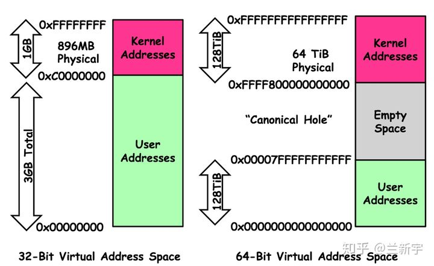
  以32位机器举例，进程的虚拟地址空间最大为4GB，其中1GB为内核空间(所有进程共享)，进程可访问的实际用户空间只有3GB
  Linux进程的内存段组成如下:
  * 保留区: 0x00000000-0x08048000
  * 代码段(text): 线程间共享，只读
  * 数据段(data): 存放已初始化的且初始值不为0的全局变量和静态局部变量，可读写
  * BSS段: 存放未初始化的静态变量、初始值为0的初始化的全局变量和静态变量、未定义且初值不为0的符号(该初值即common block的大小)，BSS段不占用可执行文件空间，推迟到加载阶段初始化为0(符号表中会有相关变量的描述)
  * 堆(heap): 堆用于存放进程运行时动态分配的内存段，可动态扩张或缩减
  * 内存映射段(mmap): mmap将文件映射到该段
  * 栈(stack): 由编译器自动分配释放，用于存放函数内的非静态局部变量、栈帧，可动态增长至RLIMIT_STACK
  * 环境变量和命令行参数
  * 其他
    * 只读数据段(rodata): 进程间共享，编译器自动去重，常量不一定在rodata，有可能在text
    * common段: 存放未初始化的全局变量(有的编译器会直接放在BSS段)
      > 强符号和弱符号
      > * 强符号指函数和初始化的全局变量(包括初始值为0的)，弱符号指未初始化的全局变量
      > * 同名的强符号只能有一个，否则链接器报"重复定义"错误
      > * 如果一个符号在某个目标文件中是强符号，在其他文件中是弱符号，那么选择强符号
      > * 如果一个符号在所有的目标文件中都是弱符号，那么选择其中占用空间最大的一个
      > * 应用: 程序在未正常链接某个库时也可以正常运行、库中定义的弱符号可以被用户定义的强符号所覆盖(例如版本用户自定义)
      >
      > 举例:
      > ```C
      > int a;                           # 弱符号
      > int b = 0;                       # 强符号
      > extern int c;                    # 外部符号，只是一个符号引用，即不是强符号也不是弱符号
      > int __attribute__((weak)) d = 2; # 弱符号
      >
      > #if defined(_WIN32)
      >   #pragma weak e
      >   int e = 2;                     # 弱符号
      > #endif
      >
      > int
      > main () {
      >   return 0;
      > }
      > ```

  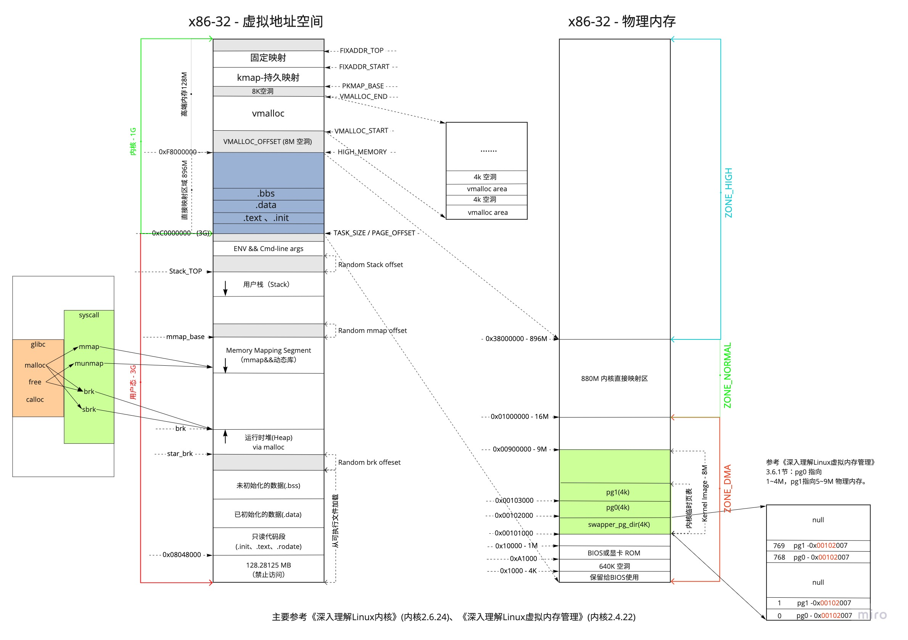
  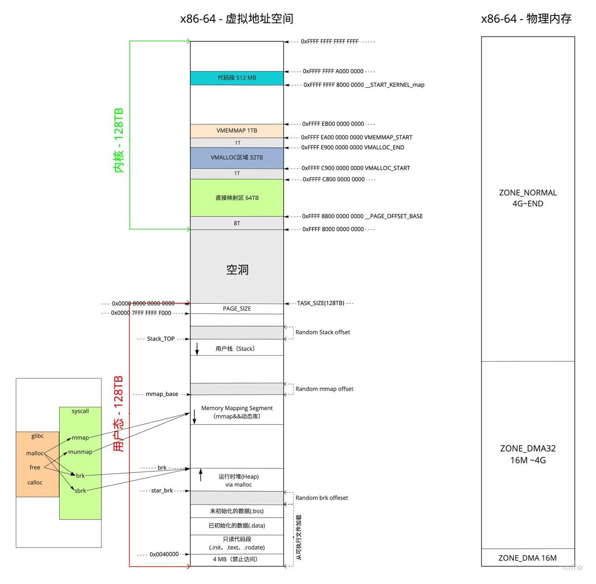

  目标文件各个段在文件中的布局:
  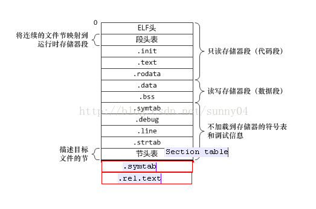

  > [更多关于虚拟地址空间的内容](https://fanlv.wiki/2021/07/25/linux-mem/)

## mmap和shm
  * mmap(内存映射):
    * 将一个文件或者其它对象映射到进程的虚拟地址空间，使用户对这段内存区域的修改可以直接反映到内核空间，相反，内核空间对这段区域的修改也直接反映用户空间
    * 读写文件时不再需要使用read、write等系统调用对文件进行读写，减少一次拷贝
    * 当访问该区域的内存页时，若该地址的数据不在内存，则产生缺页中断，OS会从磁盘中拷贝对应页到物理内存
    * 对该区域的内存页写入后，会自动延迟回写脏页面到对应磁盘地址，也可使用msync()即时写入
    * mmap 不仅可以映射到磁盘上的普通文件，还可以映射到匿名文件，但匿名映射只能在父子进程中使用
  * shm(共享内存):
    * 将新开辟的物理内存映射到不同进程的虚拟地址空间
  * malloc分配大内存实际调用的是mmap
  * 区别:
    * mmap和shm都可以达到进程间通信和进共享的目的，但shm性能更高
    * mmap实际存储反应到硬盘，shm实际存储反应到内存
    * 对于普通文件的mmap映射，当机器重启，mmap文件还保存了同步映像

## 栈、堆
  * 栈:
    * [进程栈](#vms)
    * 线程栈
      * Linux内核没有线程的概念，Linux把线程当作进程来实现
      * Linux线程和进程的共享地址空间，但栈不共享，并且不能动态增长
      * Linux线程对应单个task，每个线程拥有一个task_struct，进程实际上是一个task组，每个进程拥有一个mm_struct，进程中的线程共享mm_struct结构
    * 内核栈
      * 进程通过到系统调用陷入内核时，使用的是单独的内核空间的栈，每个进程都会拥有属于自己的内核栈
    * 中断栈
      * 中断栈同样处于内核空间，中断栈是可以和内核栈共享，具体取决于内核的实现和处理架构
    > Linux的栈大小默认为8M(ulimit -s)，可使用 `ulimit -s` 修改，Windows的栈大小默认为1M(VC6)，可使用 `/stack` 参数修改
  * 堆:
    *
  * 栈和堆:
    * 生长方向: 栈的地址增长方向取决于平台和编译器实现(比如x86的栈是向下增长的，原因是栈向下增长，堆向上增长，可以提高内存利用率)
    * 分配方式: 栈由编译器自动分配和释放;堆由程序员控制，容易产生内存泄露
    * 空间大小: 栈顶地址和栈的最大容量由系统预先规定，栈的大小超容量限制会栈溢出;堆的大小则受限于计算机系统中有效的地址空间
    * 效率: 压栈出栈由专门的指令执行，因此效率较高;堆由函数库提供，机制复杂，效率较低
    * 碎片问题: 栈是先进后出的队列，不存在碎片问题;堆的频繁申请释放操作会造成内存空间不连续，从而造成大量碎片，使程序效率降低

## 存储区域
  * 静态存储区: BSS段、数据段、代码段
  * 动态存储区: 堆、栈

## 动态库、静态库

### 动态库
  * 动态链接库映射区:

### 静态库

### **注意**
  1. **动态库中的全局变量、静态变量在进程间不会相互覆盖，写时拷贝(进程修改动态库中的全局变量、静态变量时，操作系统会重新分配内存并映射到进程地址空间，变量的逻辑地址不变)**
  2. **可执行文件和动态库同时引用同一个静态库，静态库中的全局变量和静态变量会分别初始化一次[详情](https://cloud.tencent.com/developer/article/1173666)**


# 编译原理

## PIC和PIE
  * PIC(位置无关代码)
  * PIE(位置无关可执行程序)
  * 两者是等价的，-fPIC用于生成动态库，-fPIE用与生成可执行文件

## _cdecl和__stdcall、_fastcall
  * _cdecl(_cdecl)是C/C++和MFC程序默认使用的调用约定;函数参数按照从右到左的顺序入栈，并且由调用函数者把参数弹出栈以清理堆栈(可变参数只能用__cdecl;由于每个调用__cdecl函数的代码都要包含清理堆栈的代码，产生的可执行文件大小会比较大)
  * __stdcall调用约定用于调用Win32 API函数;函数参数按照从右到左的顺序入栈，被调用的函数在返回前清理传送参数的栈，函数参数个数固定
  * _fastcall(__fastcall)约定用于对性能要求非常高的场合;_fastcall约定将函数的从左边开始的两个大小不大于4个字节(DWORD)的参数分别放在ECX和EDX寄存器，其余的参数仍旧自右向左压栈传送，被调用的函数在返回前清理传送参数的堆栈
  * thiscall仅仅应用于"C++"成员函数;this指针存放于CX寄存器，函数参数按照从右到左的顺序入栈，不能被程序员指定

## 安全和性能
  * 对于数组的for循环赋值和memcpy，gcc未优化的情况下`赋值 > for > SSE指令 = memcpy`，-O3优化级别时`赋值 >= for >= SSE指令 = memcpy`，由于存在内存由于赋值是否优化成memcpy取决于编译器、上下文、对象大小等
  * 对于比较大的数组需要注意初始化问题:
    * char arr[1024*1024] = {0}，申请栈空间，并初始化第一个元素，隐含memset
    * char arr[1024*1024] = {0,}，申请栈空间，并初始化第一个元素，隐含memset
    * char arr[1024*1024] = {}，申请栈空间，隐含memset
    * char arr[1024*1024];，只申请栈空间
  * 比较大的Union使用memset置0时，尽量只对成员实际使用的空间置0
  * 对象构造时memset整个对象会清空虚表指针，导致调用虚函数时崩溃，但静态绑定(非指针非引用)的形式调用虚函数不会崩溃


# 汇编

## ESP、EBP
  * ESP(栈指针寄存器/栈指针): 永远指向系统栈栈顶
  * EBP(基址指针寄存器/帧指针): 永远指向系统栈栈底
    
    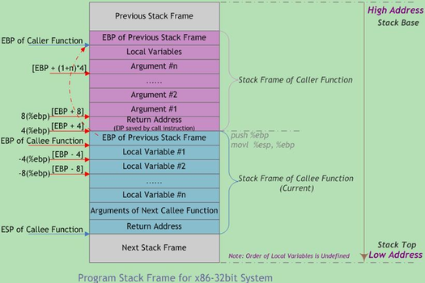


# 网络

## OSI七层网络模型
  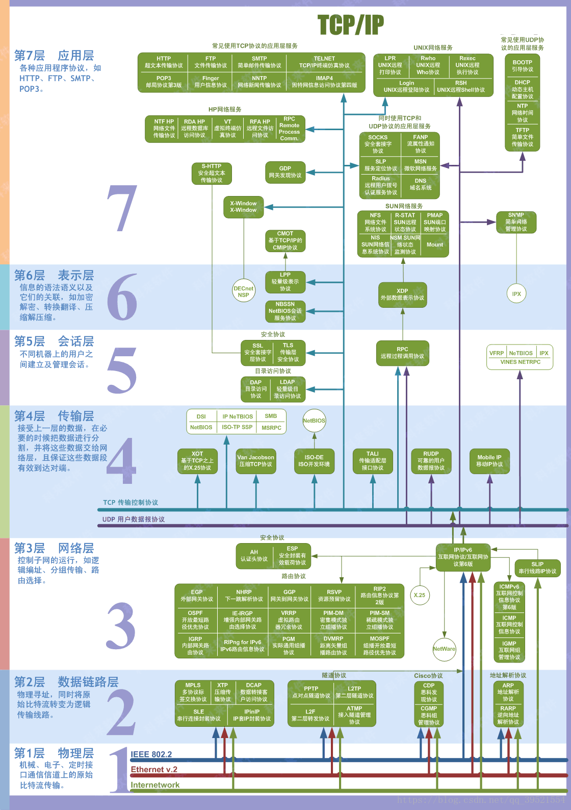

## TCP与UDP区别:
  * TCP是面向连接、可靠交付、基于字节流的通信协议
  * UDP是无连接、不可靠、面向报文的通信协议
  * TCP只能一对一通信，而UDP可以一对一、一对多、多对一、多对多
  * UDP首部仅8字节，TCP首部占20-60字节
  * UDP没有较验和、重传机制、拥塞控制、不保证数据的完整性和的顺序

## 三手握手与四次挥手:
  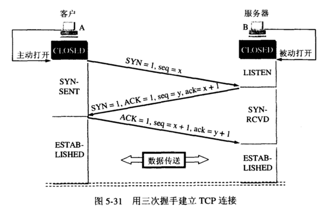
  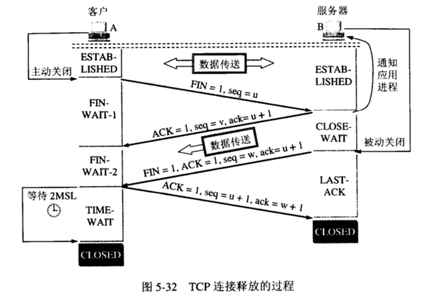

## 为什么使用三次握手:
  * 如果使用两次握手，因网络问题客户端发送了多次SYN，服务端无法判断本次请求是否为过期的连接
  * 如果使用四次握手，增加了通信次数，完全可以一个数据包同时包含ACK和SYN

## 为什么使用四次挥手:
  * 如果使用三次挥手(服务端发送的FIN与ACK合并): 导致服务端数据没有发送完就关闭连接了
  * 如果使用五次挥手，没必要

## TIME_WAIT的意义:
  * 四次挥手后主动断开一方会为四元组维持2MSL的TIME_WAIT状态(MSL: 最大报文生存时间)，当服务端发送的FIN超时还未接收到ACK会认为客户端的ACK丢失，服务端会重新发送FIN, 2SML=最后一个ACK存活时间+重传的FIN存活时间
  * 防止延迟数据段被其他相同四元组的连接接收到
  * 服务端主动关闭可能会导致大量TIME_WAIT，客户端大量连接服务端时会失败
  * 客户端主动关闭也会有相同的问题，但仍然可以连接其他服务端，只是对单一服务端失败，

## TCP可靠性:
  * 校验和
  * 应答+序列号
  * 超时重传
  * 流量控制: 传输数据双方每次交互时声明各自的接收窗口rwnd的大小，表示最大接收多少字节。为0时表示暂停接收，TCP会为连接的接收方维持一个计时器，周期发送零窗口探测报文段，防止此数据包丢失
    * 滑动窗口:
    
    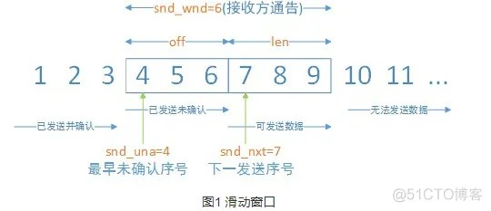
    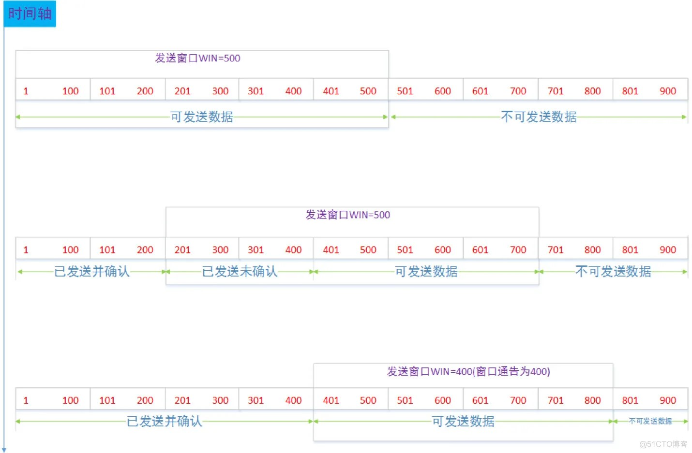
    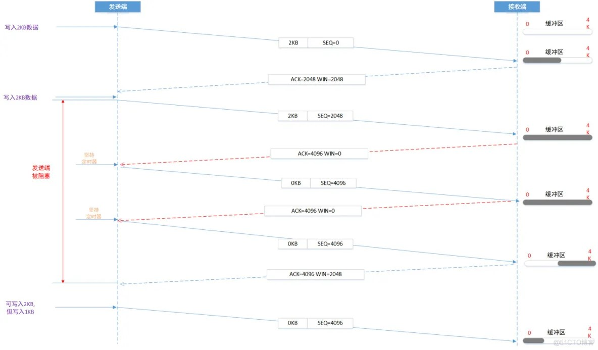

  * 拥塞控制:
    * 慢启动: 发送方维持一个拥塞窗口snd_cwnd拥塞窗口先指数增长到慢启动阈值snd_ssthressh后线性增长(拥塞避免)
    * 拥塞避免: 拥塞避免算法的思路是让拥塞窗口snd_cwnd缓慢地增大，即每经过一个往返时间RTT就把发送方的拥塞窗口snd_cwnd加1
 
    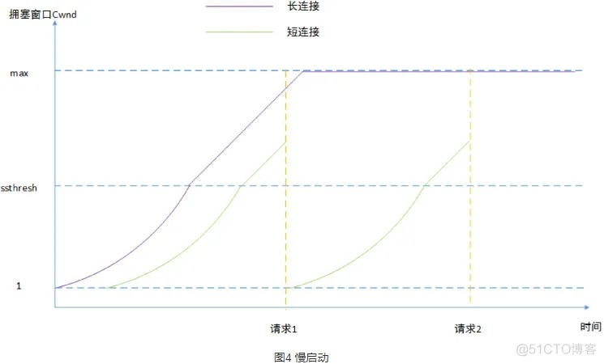
    * 快重传: 在某些情况下更早的重传丢失的报文段（当发送端接收到三个重复的确认ACK时则断定分组丢失，立即重传丢失的报文段而不必等待重传计时器超时）
    * 快恢复: 当超过设定的时间没有收到某个报文段的ACK时表示网络拥塞，慢启动阈值snd_ssthressh变为原来一半，拥塞窗口snd_cwnd=1，进入慢启动阶段
 
    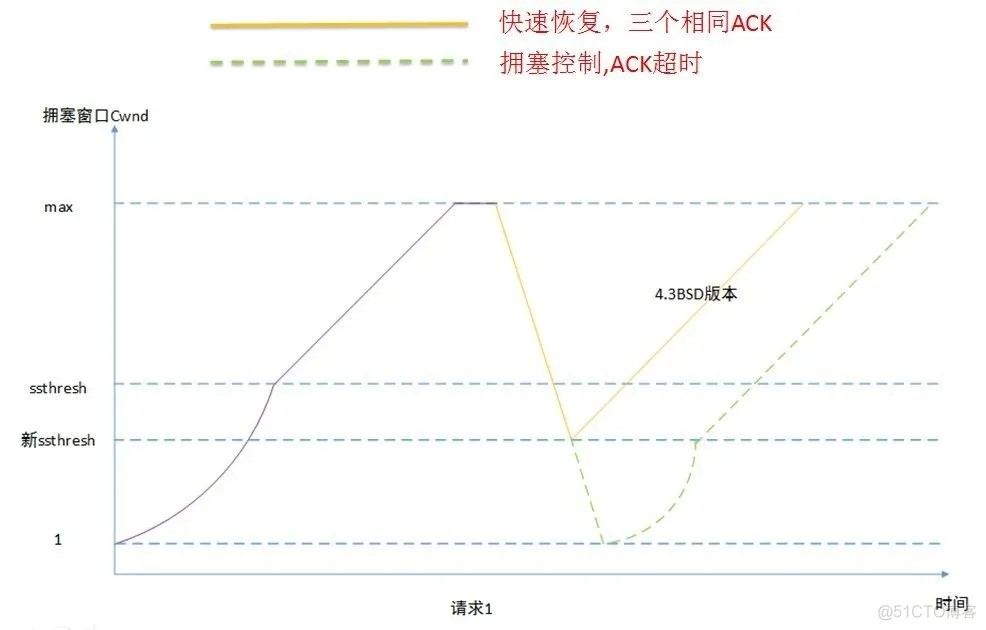
  * 拥塞控制是防止过多的数据注入到网络中，导致网络发生拥塞；而流量控制是防止发送方一下子发送过多的数据到接收方，导致接收方缓存放不下；两种算法都是对发送方的行为进行控制

## 机器的端口上限:
  * 客户端为65536，0-1023需要使用root权限才能使用
  * 服务端受限于操作系统限制，Linux可以通过修改配置修改上限

## 服务端出现大量CLOSE_WAIT的原因:
  * 服务端有大量数据没有及时发送
  * bug导致没有执行close()，如socket引用不为0无法回收

## 粘包:
  * TCP是流式传输，有可能多个将多个包合并发送，原因:
    * 发送方发送不及时
    * 接收方接收不及时
    * 发送较小的数据包时合并
  * 避免方法:
    * 发送方使用TCP_NODELAY关闭Nagle算法
    * 优化接收方接收数据过程
    * 封包和拆包时使用固定数据长度或数据中增加数据长度指示字段
  * UDP有消息保护边界，不会粘包

## TCP最大连接数:
  * 服务端：
      * 对于单个监听IP和端口的二元组，不考虑客户端ip和端口限制，理论上为客户端IP数(2^32) * 客户端端口数(2^16) = 2^48
      * 受系统、用户和进程文件描述符最大数量配置限制
      * 受系统最大追踪TCP连接数量(`/proc/sys/net/netfilter/nf_conntrack_max`(
        找不到文件则需先开启服务`$modprobe nf_conntrack`))限制
      * 受线程、CPU、内存等限制
  * 客户端:
      * 对于单个服务器IP、服务器端口和客户端IP的三元组，不考虑客户端端口限制，最多65535
      * 受端口范围限制: net.ipv4.ip_local_port_range
  * [参考](https://m.haicoder.net/note/tcpip-interview/tcpip-interview-tcp-max-conn.html)


# APUE

## 基础

### 资源限制
  * 单个进程可打开文件描述符数最大值: /proc/sys/fs/nr_open
  * 会话及其启动的单个进程可打开文件描述符最大值: limit -n
  * 指定用户可打开文件描述符最大数量: /etc/security/limits.conf
  * 系统的文件可打开描述符数最大值: /proc/sys/fs/file-max
  * 系统已使用的文件描述符数: /proc/sys/fs/file-nr

## 文件系统
## 进程
## 线程
## 同步
## 权限
## 会话、进程组
## 守护进程
## 信号
## 共享库
## 标准I/O
>[UNIX环境高级编程（APUE）学习之路](https://www.zhihu.com/column/c_1234516429204406272)

# UNP
>[UNP](https://github.com/ManyyWu/Notes/blob/master/Linux/Programming/UNP%E7%AC%94%E8%AE%B0.md)
>[服务器IO模型](https://fanlv.wiki/2018/07/15/server-io-model/)

# Autotools


# make


# CMake

# [Shell](https://github.com/ManyyWu/Notes/blob/master/Linux/Programming/Shell.md)


# [MySQl](https://fanlv.wiki/categories/MySQL/)


# [Redis](https://fanlv.wiki/categories/Redis/)


# 命令
  * nm查看符号表

# 参考
  * [C++11新特性](https://github.com/0voice/cpp_new_features/blob/main/%E5%AD%A6%E4%B9%A0%E7%AC%94%E8%AE%B0%EF%BC%9AC%2B%2B%2011%E6%96%B0%E7%89%B9%E6%80%A7.md#stdfuture%E7%9B%B8%E5%85%B3)